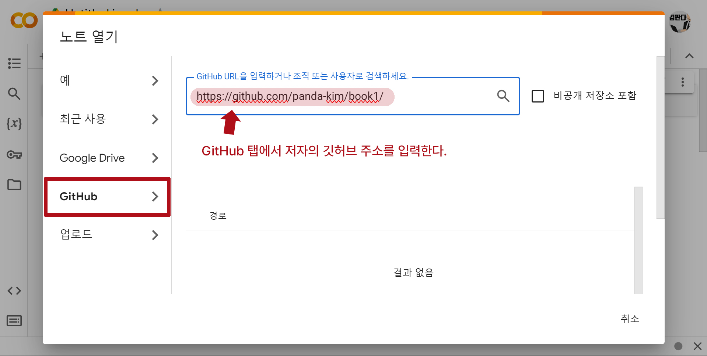
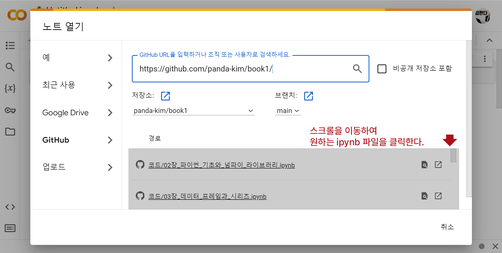
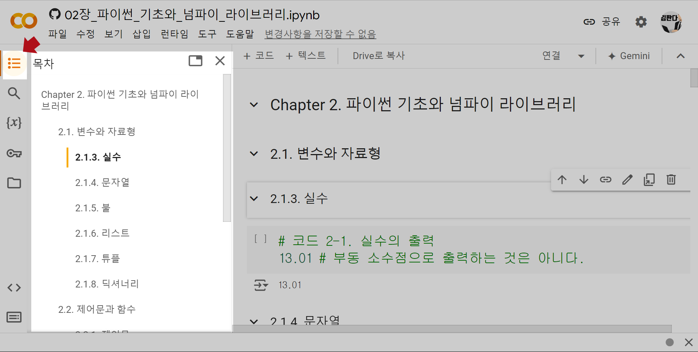

## 깃허브의 ipynb 파일을 구글 코랩에서 손쉽게 사용하는 방법

**1. 먼저 구글 코랩을 열고 [파일] - [노트 열기]를 클릭한다.**

 

**2. [노트 열기]에서 "GitHub" 탭을 클릭하고, 저자의 깃허브 주소를 입력한다.**

저자의 깃허브 주소: https://github.com/panda-kim/book1/

 

**3. 단원에 맞는 ipynb 파일을 불러온다.**

 

**4. [런타임]-[모두 실행]으로 불러온 ipynb 파일을 실행한다.**

위 과정으로 깃허브의 ipynb 파일을 구글 코랩에서 편하게 실습에 사용할 수 있다.

 

**번외**

목차 탭을 활용하면 원하는 소단원에도 손쉽게 접근할 수 있다.

