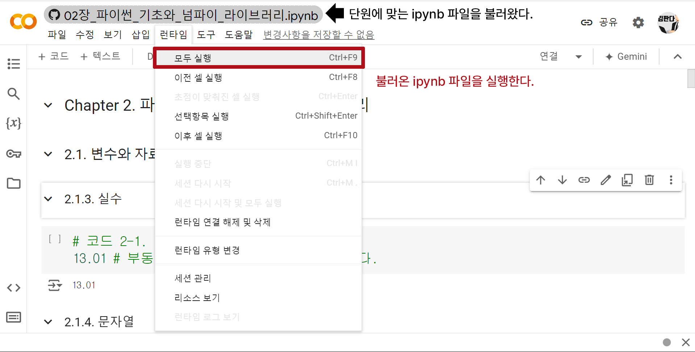

## 깃허브의 ipynb 파일을 구글 코랩에서 손쉽게 사용하는 방법

구글 코랩이 익숙하지 않으신 분들은 아래 영상을 참고하시면 큰 도움이 될 것입니다.

[구글 코랩 사용법 강의 영상](https://www.slid.cc/ko/share/vdocs/%EA%B5%AC%EA%B8%80-%EC%BD%94%EB%9E%A9google-colab-%EC%82%AC%EC%9A%A9%ED%95%98%EA%B8%B0-161d3b0d7d3d41f3b08ed7d47848db8a)

**1. 먼저 구글 코랩을 열고 [파일] - [노트 열기]를 클릭한다.**

 

**2. [노트 열기]에서 "GitHub" 탭을 클릭하고, 저자의 깃허브 주소를 입력한다.**

저자의 깃허브 주소: https://github.com/panda-kim/book1/

 

**3. 단원에 맞는 ipynb 파일을 불러온다.**

 

**4. [런타임]-[모두 실행]으로 불러온 ipynb 파일을 실행한다.**

위 과정으로 깃허브의 ipynb 파일을 구글 코랩에서 편하게 실습에 사용할 수 있다.

 

**번외**

목차 탭을 활용하면 원하는 소단원에도 손쉽게 접근할 수 있다.

